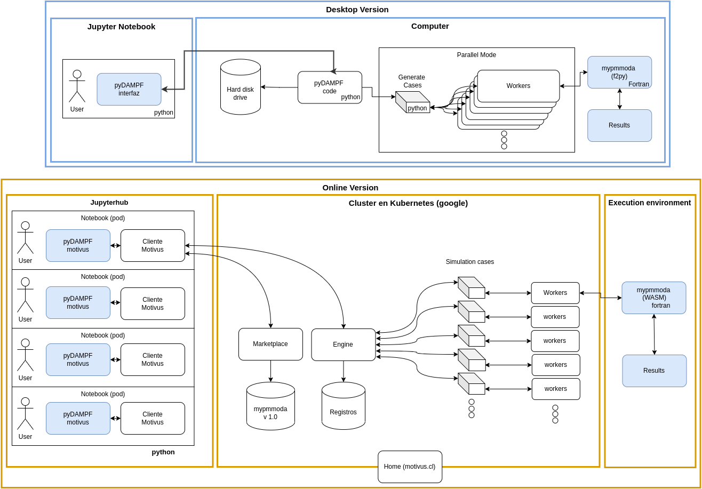

# Summary

pyDAMPF is a community-oriented Atomic Force Microscopy (AFM) tool, which allows the simulation of the physical properties of materials under varying relative humidity (RH). As shown in the paper by cite [@MenachoScipy:2022], an online version is introduced for mass use of the program through the Motivus server, with a much more user-friendly interface, which facilitates interaction with the user both in the use and in the visualization of results. 

Motivus solves two fundamental problems. The first one is associated with the high computational load of its algorithm: using the Motivus engine, the Motivus API sends each simulation case to a worker, a node in charge of solving the simulation and returning the result. Distributing the computation in this way allows to obtain results 200 times faster than a personal computer. 

The second problem is associated with the maintenance and accessibility of the algorithm to other scientists. The pyDAMPF algorithm is hosted in the motivus marketplace which allows other scientists to access its functions using the motivus library in their applications. In this way, they can obtain results in reasonable times, without the need for installations or additional computational resources to those already provided by Motivus.

This article shows the adaptation of the code published by [@MenachoScipy:2022] for an online version. The calculation engine is written in Fortran adapted in C for compilation in WASM on Motivus servers running the calculations in a Kubernetes cluster (google) and wrapped in Python with a Jupyterhub interface, even giving the possibility to store the simulations for each user individually \autoref{fig:esquema}. This is intended to provide the user with a powerful tool for AFM experiments.

# Statement of need

Esta parte ya no es del paper, es el ejempo que nos da JOSS

`Gala` 

# Mathematics

 $f(x) = e^{\pi/x}$

Double dollars make self-standing equations:

$$\Theta(x) = \left\{\begin{array}{l}
0\textrm{ if } x < 0\cr
1\textrm{ else}
\end{array}\right.$$

# Citations

Citations to entries in paper.bib should be in
[rMarkdown](http://rmarkdown.rstudio.com/authoring_bibliographies_and_citations.html)
format.

If you want to cite a software repository URL (e.g. something on GitHub without a preferred
citation) then you can do it with the example BibTeX entry below for @fidgit.

For a quick reference, the following citation commands can be used:
- `@author:2001`  ->  "Author et al. (2001)"
- `[@author:2001]` -> "(Author et al., 2001)"
- `[@author1:2001; @author2:2001]` -> "(Author1 et al., 2001; Author2 et al., 2002)"

# Figures

# Acknowledgements

We acknowledge contributions from Brigitta Sipocz, Syrtis Major, and Semyeong
Oh, and support from Kathryn Johnston during the genesis of this project.

# References
